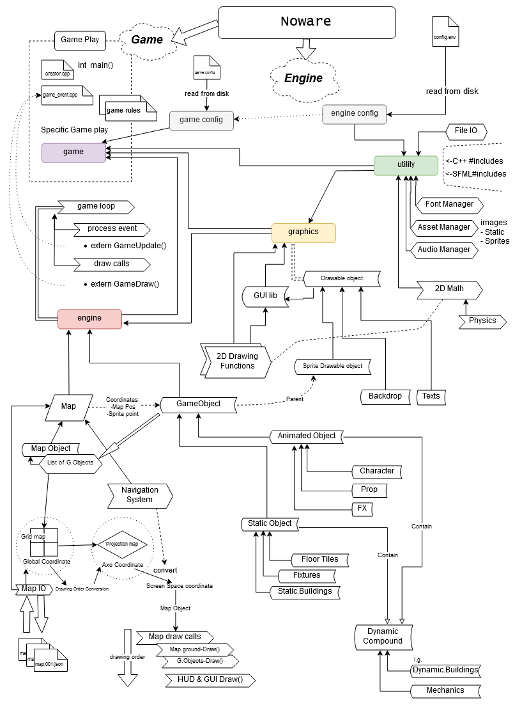
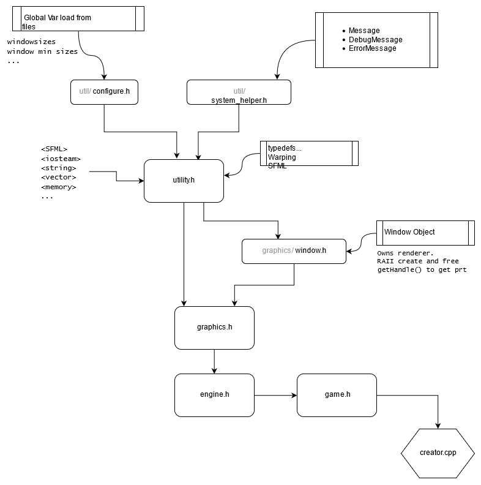

# Noware
A small C++ game/engine "Noware" development, using SFML as foundation graphics library.

----------------------------------------------------------------------
[comment]: <> (---------------------COMMENT START----------------------)
[comment]: <> (Format: Markdown format for better preview on GitHub.com)
[comment]: <> (----------------------COMMENT END-----------------------)

### Content Menu
* [1. Build Environment](#1-build-environment)
  * [1.1 Package](#11-package)
  * [1.2 build instruction](#12-build-instruction)
  * [1.3* Handy Windows custom doskey for build shortcuts](#13-handy-windows-custom-doskey-for-build-shortcuts)
* [2. File Structure](#2-file-structure)
  * [2.1 Master folder structure](#21-master-folder-structure)
  * [2.2 Source files structure](#22-source-files-structure)
* [3. Program Structure](#3-program-structure)
  * [Diagram #01:](#diagram-01)
  * [Diagram #02:](#diagram-02-relationship)


----------------------------------------------------------------------
## 1. Build Environment
##### 1.1 Package
1. CMake, MinGW Makefiles(Windows), Makefiles(Linux)
2. SFML package (see `extern/instructions.txt`)

##### 1.2 build instruction
* windows:
    > `mkdir build`
    
    > `cd build`
    * debug install
    > `cmake.exe -G "MinGW Makefiles" -DCMAKE_BUILD_TYPE=Debug ..`
    
    > `mingw32-make install`
    * release install  
    > `cmake.exe -G "MinGW Makefiles" -DCMAKE_BUILD_TYPE=Release ..`
    
    > `mingw32-make install`
* Linux:
    * N/A (not avaliable at the moment)

##### 1.3* Handy Windows custom `doskey` for build shortcuts
Content of `cmds.bat`
```
@echo off
:: MinGW and CMake Makefile shortcuts
doskey cmaked=cmake.exe -G "MinGW Makefiles" -DCMAKE_BUILD_TYPE=Debug ..
doskey cmaker=cmake.exe -G "MinGW Makefiles" -DCMAKE_BUILD_TYPE=Release ..
doskey mm=mingw32-make
doskey mmi=mingw32-make install
```
|cmake debug  | cmake release | make| make install|
|:-----------:|:------------: |:---:| :---------: |
|    `cmaked` |  `cmaker`     | `mm`|    `mmi`    |

----------------------------------------------------------------------

## 2. File Structure

##### 2.1 Master folder structure:
-  - Noware
  -  - .factory
    -  - diagrams
    -  - ico
  -  - extern
    -  - SFML
    -  - `instructions.txt`
  -  - Noware <sup>(source files)</sup>
    -  ...<sup>&darr;(see Source files structure)</sup>
  -  - `CMakeLists.txt`
  -  - `.gitignore`
  -  - `LICENSE`
  -  - `README.md`

##### 2.2 Source files structure:
-  - Noware <sup>(source files)</sup>
  -  - config
    -  - `config.env`
  -  - fonts
    -  ...
  -  - images
    -  ...
  -  - include
    -  - Noware
      -  - engine (  ... )
      -  - graphics (  ... )
      -  - util (  ... )
      -  - `engine.h`
      -  - `graphics.h`
      -  - `utility.h`
    -  - Noware_Game
      -  - game (  ... )
      -  - `game.h`
  -  - src
    -  - `creator.cpp` &larr; (Entry Point)
    -  - Noware
      -  - engine (  ... )
      -  - graphics (  ... )
      -  - util (  ... )
      -  - `engine.cpp`
      -  - `graphics.cpp`
      -  - `utility.cpp`
      -  - `CMakeLists.txt`
    -  - Noware_Game
      -  - game (  ... )
      -  - `game.cpp`
      -  - `CMakeLists.txt`
  -  - `CMakeLists.txt`

----------------------------------------------------------------------

## 3. Program Structure
##### Diagram #01:




##### Diagram #02 Relationship:




----------------------------------------------------------------------
[comment]: <> (---------------------COMMENT START----------------------)
[comment]: <> (            End of README Markdown File                 )
[comment]: <> (----------------------COMMENT END-----------------------)

[<p align="center"> ____ &uarr; Go back to Top &uarr; ____</p>](#noware) 

----------------------------------------------------------------------